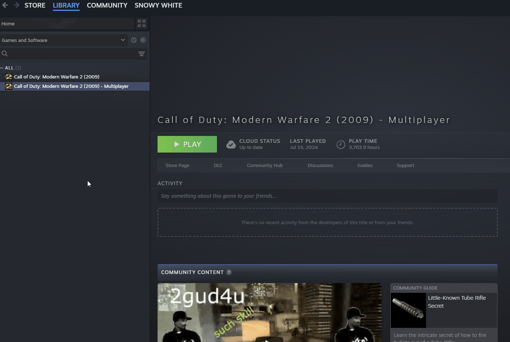
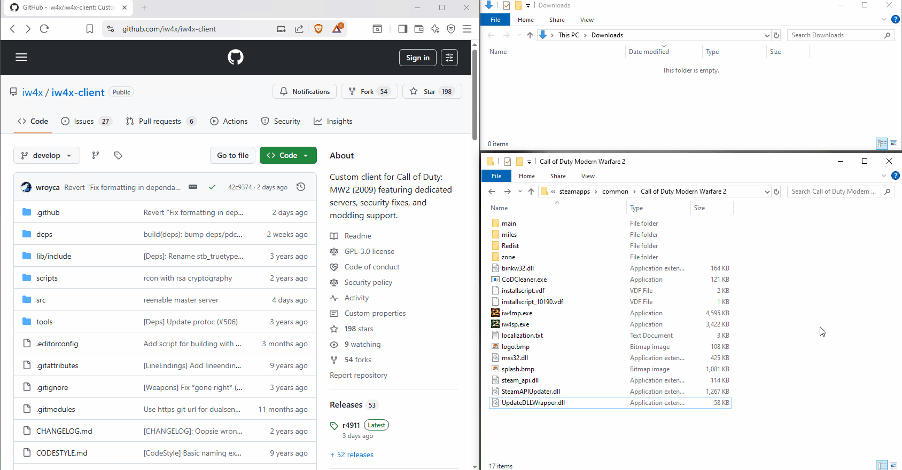
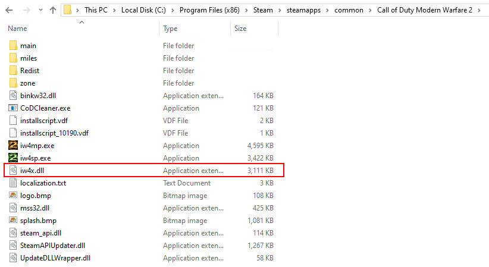
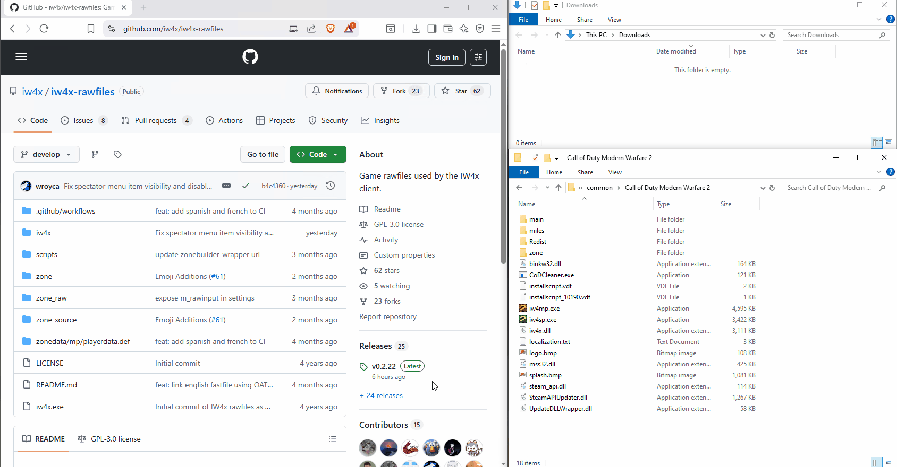
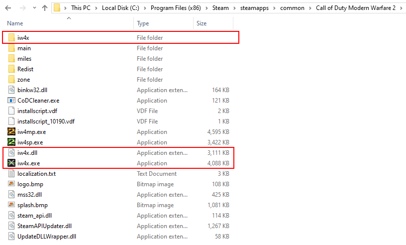

import { LinkButton } from '@astrojs/starlight/components';
import { FileTree } from '@astrojs/starlight/components';
import { Image } from 'astro:assets';
import install_folder from '../../../../assets/img/install/0.1/find_install_folder.gif';

## Prerequisites

IW4x is not a game on its own. It requires **Call of Duty: Modern Warfare 2 (2009)** to be installed.\
If you do not own the game yet, please first buy and install it [**from Steam**](https://store.steampowered.com/app/10180/Call_of_Duty_Modern_Warfare_2_2009/).

:::danger[Only Steam Version is supported]
IW4x does not work with pirated copies or the Microsoft Store version!
:::

## How does IW4x work?

When you launch IW4x, it starts a customized version of the game that supports new features and enhancements specific to IW4x.

<details>
  <summary>More Details</summary>

  At its core, IW4x is made up of two main files: `iw4x.exe` and `iw4x.dll`.\
  The executable file, `iw4x.exe`, is the customized version of the original `iw4mp.exe`.\
  Unlike the official version, `iw4x.exe` loads the `iw4x.dll` file during startup.\
  This DLL file contains the actual functionality of IW4x. It's the output you'll get from compiling the source code, available on [GitHub](https://github.com/iw4x/iw4x-client).
</details>

By installing IW4x in the same directory as the original Modern Warfare 2 game, it’s able to reuse the base game’s assets.\
In addition, IW4x introduces extra content such as new maps, weapons, calling cards, and more.\
These additional assets are also available on [GitHub](https://github.com/iw4x/iw4x-rawfiles) and must be installed separately for IW4x to function correctly.

In the next section, we’ll walk you through the installation process step by step.

***

## Installing on Windows

Installing IW4x manually requires only a few simple steps:

* Find MW2 installation
* Download `iw4x.dll`
* Download `raw files`
* Unpack `raw files`
* Start the game

### 1. Find your Modern Warfare 2 installation

IW4x needs to be installed in the same directory where Modern Warfare 2 is installed.\
It's usually in `C:\Program Files (x86)\Steam\steamapps\common\Call of Duty Modern Warfare 2`.\
If you have trouble finding it, the easiest way is to open your Steam Library and then:

* Right-click on **Call of Duty: Modern Warfare 2 (2009) - Multiplayer**
* Select **Manage > Browse local files**

This will open the directory where the game is installed.



### 2. Download IW4x

Once you've found your MW2 installation, you can go ahead and download the IW4x DLL file:

<LinkButton href="https://github.com/iw4x/iw4x-client/releases/latest/download/iw4x.dll" variant="primary" icon="seti:windows" iconPlacement="start">Download iw4x.dll</LinkButton>



Make sure that your game folder now looks like this:



### 3. Download Raw Files

The [raw files](https://github.com/iw4x/iw4x-rawfiles) are additional assets (maps, weapons, scripts. etc.) to make your experience better.\
Like in the previous step, you can simply download the latest release version and save it to your game folder.

<LinkButton href="https://github.com/iw4x/iw4x-rawfiles/releases/latest/download/release.zip" variant="primary" icon="seti:windows" iconPlacement="start">Download IW4x Raw Files</LinkButton>

The files are compressed in a ZIP archive and need to be extracted first.\
The easiest way to do so is to select the archive and then:

* Click on **Compressed Folder Tools**
* Click on **Extract all**
* Click on **Extract**

Make sure to extract them to the root directory of your game folder (not in an additional `release` sub-folder).



Make sure that your game folder looks now looks like this:



### 4. Run IW4x

Now you can double-click on `IW4x.exe` and start gaming! 😎🎮

### PowerShell Commands

:::note[Info]
If you have followed all the previous steps, you can skip what's coming next.\
This is just extra information for those who are experienced with PowerShell.
:::

The steps described above can also be done in the terminal. Make sure to `cd` into the game directory:

```powershell title="PowerShell"
cd "C:\Program Files (x86)\Steam\steamapps\common\Call of Duty Modern Warfare 2"
```

Then you can download `iw4x.dll` and the `raw files`:

```powershell title="PowerShell"
Invoke-WebRequest -Uri https://github.com/iw4x/iw4x-client/releases/latest/download/iw4x.dll -OutFile iw4x.dll
Invoke-WebRequest -Uri https://github.com/iw4x/iw4x-rawfiles/releases/latest/download/release.zip -OutFile iw4x-rawfiles.zip
```

Once downloaded, the only step left is to extract the content of the ZIP archive:

```powershell title="PowerShell"
Expand-Archive iw4x-rawfiles.zip -DestinationPath "C:\Program Files (x86)\Steam\steamapps\common\Call of Duty Modern Warfare 2"
```

And if you have some spare time, to delete the downloaded archive:

```powershell title="PowerShell"
Remove-Item iw4x-rawfiles.zip
```

## Installing on Linux

On Linux, the situation requires additional nuance. Modern Warfare 2 was never released natively, yet today two practical paths exist: the first through **Proton**, Steam’s built-in compatibility layer, and the second through a **custom Wine prefix** managed by the user.\
Both approaches share the same destination: IW4x residing beside the MW2 executable, extending it in the same way as on Windows.

### Using Proton

By default, Steam now enables Proton for Windows-only titles. This means that once Modern Warfare 2 is installed through Steam, the underlying runtime is already in place, requiring no special configuration. Introducing IW4x then becomes a matter of downloading the required files, the binary release and the rawfiles package, and extracting them into the MW2 Proton directory.

For example, assuming `$STEAMLIBRARY` points to your Steam library, IW4x can be merged into the installation with a single command:

```bash title="bash"
curl -L https://github.com/iw4x/iw4x-client/releases/latest/download/iw4x.dll -o iw4x.dll
curl -L https://github.com/iw4x/iw4x-rawfiles/releases/latest/download/release.zip -o release.zip
unzip -o release.zip -d "$STEAMLIBRARY/steamapps/common/Call of Duty Modern Warfare 2"
```

From there, launching Modern Warfare 2 through Steam also launches IW4x, the Proton layer handles all necessary translations in the background.

### Using Wine Prefix

Others prefer not to rely on Proton’s managed environment. In that case, a dedicated Wine prefix must be created and configured.\
The process requires several steps, which are described below:

1. **Create a new prefix:**

   ```bash title="bash"
   WINEPREFIX=~/.wine-mw2 wineboot
   ```

2. **Install required runtimes:**

   IW4x and Modern Warfare 2 expect a number of Microsoft libraries to be present. These can be installed with `winetricks`:

   ```bash title="bash"
   WINEPREFIX=~/.wine-mw2 winetricks vcrun2019 d3dcompiler_47 dxvk
   ```

3. **Acquire Modern Warfare 2:**

   The game can be installed through Steam running inside that prefix, or by retrieving the files directly using `DepotDownloader`:

   ```bash title="bash"
   ./DepotDownloader -app 10190 -username <username> -password <password>
   ```

4. **Add IW4x:**

   With the base game in place, the IW4x files can be downloaded into the prefix’s game directory:

   ```bash title="bash"
   curl -L https://github.com/iw4x/iw4x-client/releases/latest/download/iw4x.dll -o iw4x.dll
   curl -L https://github.com/iw4x/iw4x-rawfiles/releases/latest/download/release.zip -o release.zip
   unzip -o release.zip -d ~/.wine-mw2/drive_c/Program\ Files/Steam/steamapps/common/Call\ of\ Duty\ Modern\ Warfare\ 2
   ```

Once the base game is present, the IW4x files are obtained as before and extracted into the game’s folder within the prefix.\
Running the game then becomes a matter of invoking Wine explicitly:

```bash title="bash"
WINEPREFIX=~/.wine-mw2 wine iw4x.exe
```

Though more involved, this method grants precise control over the runtime environment, which some users may prefer.

***

## Installing on macOS

MacOS follows a similar trajectory to Linux, with the additional complexity that Wine must often be wrapped within a managed runtime such as **CrossOver** or **WineSkin**. These frameworks exist not to alter IW4x itself, but to satisfy the platform restrictions of macOS.\
The installation steps, ensuring the base MW2 files are present, placing `iw4x.dll` and the `raw files` alongside the executable, and then invoking the new binary, remain conceptually identical.

The result is that IW4x on MacOS is less a separate port than a faithful reproduction of the Windows environment, hosted within a compatibility container. While this may appear circuitous, it underscores IW4x’s neutrality: the project provides only the essential modifications.\
It is this simplicity that makes IW4x portable across different operating systems, even when those systems themselves were never official targets for Modern Warfare 2.

## Need more Help?

If you run into any issue with IW4x or while following these guide, we are happy to help you out on our [Discord server](https://discord.com/invite/pV2qJscTXf)!

<center>
  [](https://discord.com/invite/pV2qJscTXf)
</center>
