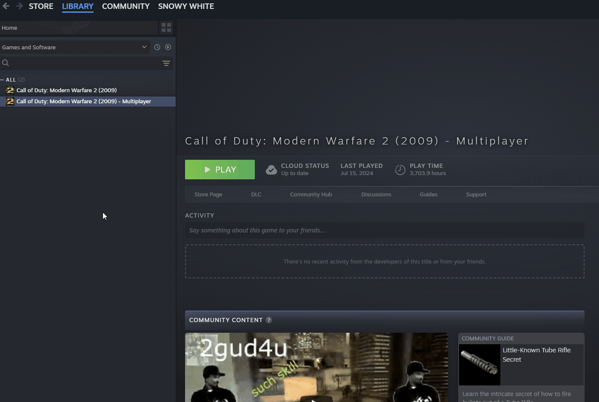
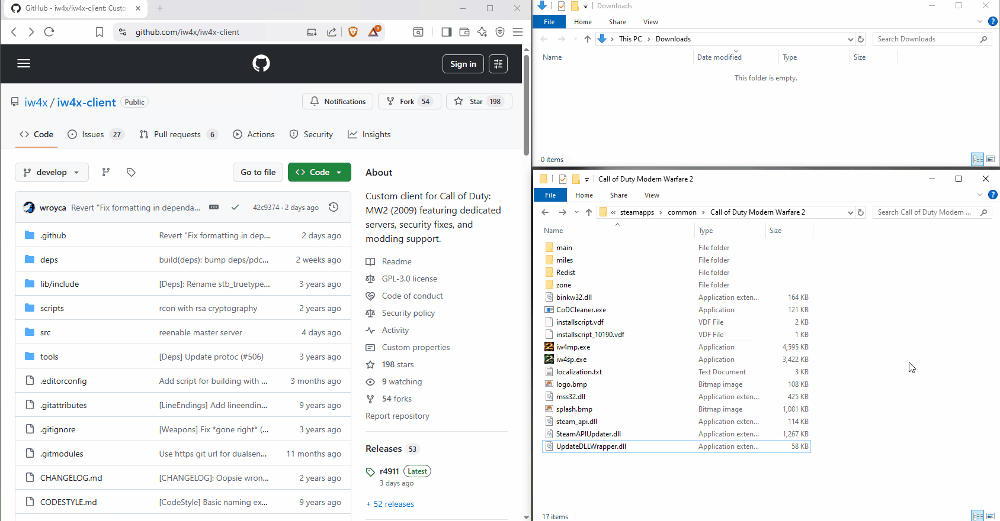
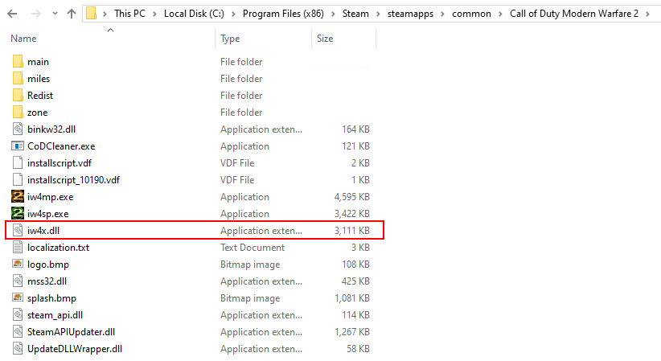
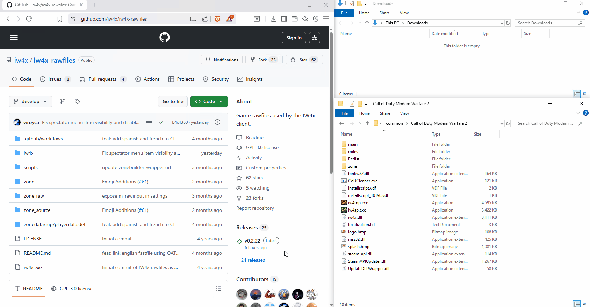

import { Steps, LinkButton } from '@astrojs/starlight/components';
import { Image } from 'astro:assets';
import install_folder from '../../../../assets/img/install/find_install_folder.gif';

### 1. Find your Modern Warfare 2 installation

IW4x needs to be installed in the same directory where Modern Warfare 2 is installed.  
It's usually in `C:\Program Files (x86)\Steam\steamapps\common\Call of Duty Modern Warfare 2`.  
If you have trouble finding it, the easiest way is to open your Steam Library and then:

<Steps>

1. Right-click on **Call of Duty: Modern Warfare 2 (2009) - Multiplayer**

2. Select **Manage > Browse local files**

    

</Steps>

### 2. Download IW4x

Once you've found your MW2 installation, you can go ahead and download the IW4x DLL:

<LinkButton
    href="https://github.com/iw4x/iw4x-client/releases/latest/download/iw4x.dll"
    variant="primary"
    icon="seti:windows"
    iconPlacement="start"
>Download **iw4x.dll**</LinkButton>



Make sure that your game folder now looks like this:



### 3. Download Raw Files

The [raw files](https://github.com/iw4x/iw4x-rawfiles) are additional assets (maps, weapons, scripts. etc.) to make your experience better.  
Like in the [previous step](#2-download-iw4x), you can simply download the latest release version and save it to your game folder.

<LinkButton
    href="https://github.com/iw4x/iw4x-rawfiles/releases/latest/download/release.zip"
    variant="primary"
    icon="seti:windows"
    iconPlacement="start"
>Download **IW4x Raw Files**</LinkButton>

The files are compressed in a ZIP archive and need to be extracted first.  
The easiest way to do so is to select the archive and then:

<Steps>

1. Click on **Compressed Folder Tools**

2. Click on **Extract all**

3. Click on **Extract**

    Make sure to extract them to the root directory of your game folder (not in an additional `release` sub-folder).

    

</Steps>

Make sure that your game folder looks now looks like this:


### 4. Run IW4x

Now you can double-click on `IW4x.exe` and start gaming! 😎🎮

### Install using PowerShell

:::note[Info]
Feel free to skip this part if you have followed all the previous steps or if you are unfamiliar with working in a terminal.
This is just an alternative way for those who are experienced with PowerShell.
:::

<Steps>

1. **`cd` into the [game directory](#1-find-your-modern-warfare-2-installation)**

   ```ps
   cd "C:\Program Files (x86)\Steam\steamapps\common\Call of Duty Modern Warfare 2"
   ```

2. **Download `iw4x.dll`**

   ```ps
   Invoke-WebRequest -Uri https://github.com/iw4x/iw4x-client/releases/latest/download/iw4x.dll -OutFile iw4x.dll
   ```

3. **Download `raw files`**

   ```ps
   Invoke-WebRequest -Uri https://github.com/iw4x/iw4x-rawfiles/releases/latest/download/release.zip -OutFile release.zip
   ```

4. **Extract archive**

   ```ps
   Expand-Archive release.zip -DestinationPath "C:\Program Files (x86)\Steam\steamapps\common\Call of Duty Modern Warfare 2"
   ```

5. **Delete downloaded archive**

   ```ps
   Remove-Item release.zip
   ```

</Steps>

## Need more Help?

If you run into any issue with IW4x or while following these guide, we are happy to help you out on our [Discord server](https://discord.com/invite/pV2qJscTXf)!

<center>
[](https://discord.com/invite/pV2qJscTXf)
</center>
