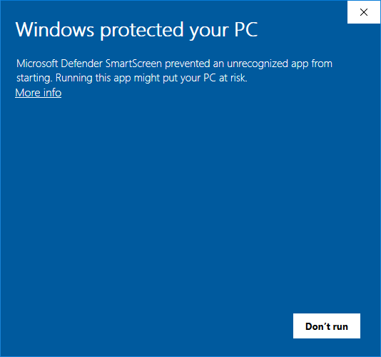

import { FileTree, LinkButton, Tabs, TabItem, Steps } from '@astrojs/starlight/components';

import Video from '../../../../components/Video.astro';
import find_directory from "../../../../assets/vid/install/find_directory.mp4";
import download_launcher from "../../../../assets/vid/install/download_launcher.mp4";

## Предварительные условия

Клиент IW4x не является самостоятельной игрой для него потребуется установленная игра **Call of Duty: Modern Warfare 2 (2009)**.  
Если у вас еще нет игры, пожалуйста, сначала купите и установите ее [**из Steam-а**](https://store.steampowered.com/app/10180/Call_of_Duty_Modern_Warfare_2_2009/).  

:::danger[Important Compatibility Notice]
По состоянию на 2025 год, *Call of Duty: Modern Warfare 2* также доступна в Microsoft Store.  
**Обратите внимание**: IW4x **не совместим** с этой версией. Поддерживается только **самая последняя версия игры из Steam-а**.

Кроме того, мы часто сталкиваемся с проблемами, на пиратских версиях, включая ошибки и сбои.  
Мы **не поддерживаем** пиратские копии игры и не оказываем им **никакой помощи**.
:::

Iw4x необходимо установить в ту же директорию, где находится *Call of Duty: Modern Warfare 2*.  
Обычно путь к этому каталогу выглядит так:

<Tabs>

  <TabItem label="Windows" icon="seti:windows">
  ```cmd
   C:\Program Files (x86)\Steam\steamapps\common\Call of Duty Modern Warfare 2
  ```
  </TabItem>

  <TabItem label="Linux" icon="linux">
  ```sh
   $STEAMLIBRARY/steamapps/common/Call of Duty Modern Warfare 2
  ```
  </TabItem>

  <TabItem label="MacOS" icon="apple">
  ```sh
   ~/Library/Application Support/Steam/steamapps/common/Call of Duty Modern Warfare 2
  ```
  </TabItem>

</Tabs>

## Где установлена Steam версия Modern Warfare 2

Если вам трудно найти директорию установки, вы можете воспользоваться библиотекой Steam в качестве помощника:

<Steps>

1. Откройте Steam и перейдите в **LIBRARY**.

2. Щелкните правой кнопкой мыши на **Call of Duty: Modern Warfare 2 (2009) - мультиплеер**

3. Выберите **Управление > Просмотр локальных файлов**.

    <Video src={find_directory} />

</Steps>

## Установка IW4x

После того как вы нашли каталог с игрой Modern Warfare 2, самый простой способ установить клиент IW4x это использовать Лаунчер, который автоматически загрузит и установит(или обновит) все необходимые файлы.

<Steps>

1. Скачайте лаунчер из [GitHub](https://github.com/iw4x/launcher)

    <LinkButton href="https://github.com/iw4x/launcher/releases/latest/download/iw4x-launcher.exe" variant="primary" icon="seti:windows" iconPlacement="start">**Скачать для Windows**</LinkButton>
    <LinkButton href="https://github.com/iw4x/launcher/releases/latest/download/iw4x-launcher-x86_64-unknown-linux-gnu.tar.gz" variant="primary" icon="linux" iconPlacement="start">**Скачать для Linux**</LinkButton>

2. Переместите его в каталог Modern Warfare 2

3. Дважды щелкните на программе iw4x-launcher.exe, чтобы начать установку

    <Video src={download_launcher} />

</Steps>

:::caution[Windows protected your PC]
При первом запуске **iw4x-launcher.exe** Windows может выдать предупреждение.  
Это происходит потому, что данный файл не часто встречается в системах Windows.  
Это совершенно нормальное поведение - Лаунчер вполне безопасен для использования.  
Если вы увидите предупреждение, можете смело нажать на **`Дополнительная информация`**, а затем **`Запустить в любом случае`**.



(И да, предупреждение можно убрать, но для этого требуется сертификат подписания кода от Microsoft, который стоит немалых денег).
:::

## Использование Лаунчера

:::note
Мы рекомендуем использовать Лаунчер каждый раз, когда вы играете в IW4x.  
Он автоматически загружает все обновления, а также предоставляет дополнительные возможности для настройки.
:::

После установки IW4x в каталоге игры должны появиться следующие папки и файлы:

<FileTree>
- `Call of Duty: Modern Warfare 2`
  - iw4x/
  - **launcher**
    - cache.json
    - **config.json**
    - log.log
  - iw4x.exe
  - iw4x-launcher.exe
  - ... и другие файлы и папки
</FileTree>

Если вы откроете **config.json** в текстовом редакторе (например, в Блокноте), то увидите нечто подобное:

```json title="launcher/config.json"
{
  "update_only": false,
  "skip_self_update": false,
  "force_update": false,
  "args": "-stdout",
  "offline": false,
  "testing": false,
  "disable_art": false,
  "dxvk": false
}
```

Данные значения конфигурации, вы можете настроить в соответствии со своими предпочтениями (подробнее о каждой опции на [GitHub](https://github.com/iw4x/launcher#%EF%B8%8F-command-line-arguments)).  
Наиболее важной частью является секция конфигурации `"args"`: Аргументы, которые вы там добавите, будут использоваться каждый раз, при запуске игры через Лаунчер.  

Например, для игры оффлайн против ботов, используя [Bot Warfare Mod](https://github.com/ineedbots/iw4_bot_warfare), можно задать `"args"` следующим образом:

```diff lang="json" ins=" -disable-mod-unloading +set fs_game mods/mp_bots"
{
  "args": "-stdout -disable-mod-unloading +set fs_game mods/mp_bots",
  "offline": false,
  "testing": false,
  "disable_art": false,
  "dxvk": false
}
```

Теперь каждый раз, при запуске игры через Лаунчер, она автоматически будет загружать мод Bot Warfare!
